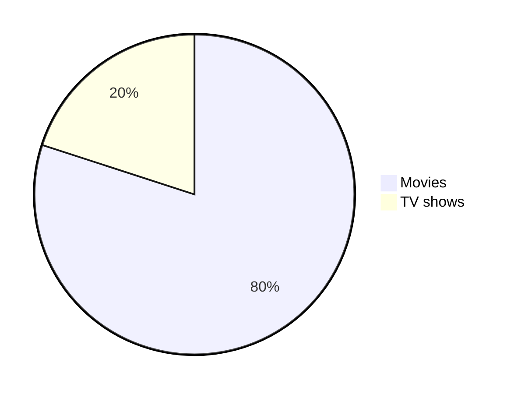

# Mi Hoja de Trucos de Markdown
---

# Encabezados

```
# Encabezado 1
## Encabezado 2
### Encabezado 3
#### Encabezado 4
##### Encabezado 5
```

# Encabezado 1
## Encabezado 2
### Encabezado 3
#### Encabezado 4
##### Encabezado 5

```
<h1>Encabezado 1</h1>
<h2>Encabezado 2</h2>
<h3>Encabezado 3</h3>
<h4>Encabezado 4</h4>
<h5>Encabezado 5</h5>
```

<h1>Encabezado 1</h1>
<h2>Encabezado 2</h2>
<h3>Encabezado 3</h3>
<h4>Encabezado 4</h4>
<h5>Encabezado 5</h5>

Encabezado 1
=
Encabezado 2
-

# Estilos de texto

```
Bold
**El rápido zorro marrón salta sobre el perro perezoso..**
__El rápido zorro marrón salta sobre el perro perezoso..__
<strong>El rápido zorro marrón salta sobre el perro perezoso..</strong>
Italic
*El rápido zorro marrón salta sobre el perro perezoso..*
_El rápido zorro marrón salta sobre el perro perezoso.._
<em>El rápido zorro marrón salta sobre el perro perezoso..</em>
Bold y Italic
**_El rápido zorro marrón salta sobre el perro perezoso.._**
<strong><em>El rápido zorro marrón salta sobre el perro perezoso..</em></strong>
```

El rápido zorro marrón salta sobre el perro perezoso..

Bold

**El rápido zorro marrón salta sobre el perro perezoso..**

__El rápido zorro marrón salta sobre el perro perezoso..__

<strong>El rápido zorro marrón salta sobre el perro perezoso..</strong>


Italic

*El rápido zorro marrón salta sobre el perro perezoso..*

_El rápido zorro marrón salta sobre el perro perezoso.._

<em>El rápido zorro marrón salta sobre el perro perezoso..</em>

Bold y Italic

**_El rápido zorro marrón salta sobre el perro perezoso.._**

<strong><em>El rápido zorro marrón salta sobre el perro perezoso..</em></strong>

Blockquotes

```
> El rápido zorro marrón salta sobre el perro perezoso..
> El rápido zorro marrón salta sobre el perro perezoso..
> 
> El rápido zorro marrón salta sobre el perro perezoso..
> 
> El rápido zorro marrón salta sobre el perro perezoso..
> El rápido zorro marrón salta sobre el perro perezoso..
>> El rápido zorro marrón salta sobre el perro perezoso..
>>> El rápido zorro marrón salta sobre el perro perezoso..
> **The quick brown fox** *jumps over the lazy dog.*
```

> El rápido zorro marrón salta sobre el perro perezoso..
> El rápido zorro marrón salta sobre el perro perezoso..
> 
> El rápido zorro marrón salta sobre el perro perezoso..
> 
> El rápido zorro marrón salta sobre el perro perezoso..
> El rápido zorro marrón salta sobre el perro perezoso..
>> El rápido zorro marrón salta sobre el perro perezoso..
>>> El rápido zorro marrón salta sobre el perro perezoso..
> **The quick brown fox** *jumps over the lazy dog.*
```
Monospaced
<samp>El rápido zorro marrón salta sobre el perro perezoso..</samp>
Underlined
<ins>El rápido zorro marrón salta sobre el perro perezoso..</ins>
Strike-through
~~El rápido zorro marrón salta sobre el perro perezoso..~~
```

Monospaced

<samp>El rápido zorro marrón salta sobre el perro perezoso..</samp>

Underlined

<ins>El rápido zorro marrón salta sobre el perro perezoso..</ins>

Strike-through

~~El rápido zorro marrón salta sobre el perro perezoso..~~

```
Boxed
<table><tr><td>El rápido zorro marrón salta sobre el perro perezoso..</td></tr></table>
```

Boxed

<table><tr><td>El rápido zorro marrón salta sobre el perro perezoso..</td></tr></table>


```
2 <sup>53-1</sup> y -2 <sup>53-1</sup> 
```

2 <sup>53-1</sup> y -2 <sup>53-1</sup> 

```
Subscript <sub>El rápido zorro marrón salta sobre el perro perezoso..</sub>
Superscript <sup>El rápido zorro marrón salta sobre el perro perezoso..</sup>
```

Subscript <sub>El rápido zorro marrón salta sobre el perro perezoso..</sub>

Superscript <sup>El rápido zorro marrón salta sobre el perro perezoso..</sup>


# Resaltado de sintaxis

Un método de clase es un método de instancia del objeto de clase. Cuando se crea una nueva clase, un objeto de tipo `Class` se inicializa y se asigna a una constante global (Móvil en este caso).


```
public static String monthNames[] = {"January", "February", "March", "April", "May", "June", "July", "August", "September", "October", "November", "December"};
```


```java
public static String monthNames[] = {"January", "February", "March", "April", "May", "June", "July", "August", "September", "October", "November", "December"};
```

# Alineaciones
```
<p align="left">

</p>
```

<p align="left">

</p>

```
<p align="center">

</p>
```

<p align="center">

</p>

```
<p align="right">

</p>
```

<p align="right">

</p>

```
<h3 align="center"> My latest Medium posts </h3>
```

<h3 align="center"> My latest Medium posts </h3>


# Tablas

```
<table>
<tr>
<td width="33%"">
El rápido zorro marrón salta sobre el perro perezoso..
</td>
<td width="33%">
El rápido zorro marrón salta sobre el perro perezoso..
</td>
<td width="33%">
El rápido zorro marrón salta sobre el perro perezoso..
</td>
</tr>
</table>
```

<table>
<tr>
<td width="33%"">
El rápido zorro marrón salta sobre el perro perezoso..
</td>
<td width="33%">
El rápido zorro marrón salta sobre el perro perezoso..
</td>
<td width="33%">
El rápido zorro marrón salta sobre el perro perezoso..
</td>
</tr>
</table>


```
| Default | Left align | Center align | Right align |
| - | :- | :-: | -: |
| 9999999999 | 9999999999 | 9999999999 | 9999999999 |
| 999999999 | 999999999 | 999999999 | 999999999 |
| 99999999 | 99999999 | 99999999 | 99999999 |
| 9999999 | 9999999 | 9999999 | 9999999 |
| Default    | Left align | Center align | Right align |
| ---------- | :--------- | :----------: | ----------: |
| 9999999999 | 9999999999 | 9999999999   | 9999999999  |
| 999999999  | 999999999  | 999999999    | 999999999   |
| 99999999   | 99999999   | 99999999     | 99999999    |
| 9999999    | 9999999    | 9999999      | 9999999     |
Default    | Left align | Center align | Right align
---------- | :--------- | :----------: | ----------:
9999999999 | 9999999999 | 9999999999   | 9999999999 
999999999  | 999999999  | 999999999    | 999999999  
99999999   | 99999999   | 99999999     | 99999999   
9999999    | 9999999    | 9999999      | 9999999 
```

| Default | Left align | Center align | Right align |
| - | :- | :-: | -: |
| 9999999999 | 9999999999 | 9999999999 | 9999999999 |
| 999999999 | 999999999 | 999999999 | 999999999 |
| 99999999 | 99999999 | 99999999 | 99999999 |
| 9999999 | 9999999 | 9999999 | 9999999 |


| Default    | Left align | Center align | Right align |
| ---------- | :--------- | :----------: | ----------: |
| 9999999999 | 9999999999 | 9999999999   | 9999999999  |
| 999999999  | 999999999  | 999999999    | 999999999   |
| 99999999   | 99999999   | 99999999     | 99999999    |
| 9999999    | 9999999    | 9999999      | 9999999     |


Default    | Left align | Center align | Right align
---------- | :--------- | :----------: | ----------:
9999999999 | 9999999999 | 9999999999   | 9999999999 
999999999  | 999999999  | 999999999    | 999999999  
99999999   | 99999999   | 99999999     | 99999999   
9999999    | 9999999    | 9999999      | 9999999 


```
<table>
<tr>
<th>Encabezado 1</th>
<th>Encabezado 2</th>
</tr>
<tr>
<td>
| A | B | C |
|--|--|--|
| 1 | 2 | 3 |
</td><td>
| A | B | C |
|--|--|--|
| 1 | 2 | 3 |
</td></tr> </table>
```

<table>
<tr>
<th>Encabezado 1</th>
<th>Encabezado 2</th>
</tr>
<tr>

<td>

| A | B | C |
|--|--|--|
| 1 | 2 | 3 |

</td><td>

| A | B | C |
|--|--|--|
| 1 | 2 | 3 |

</td></tr> </table>

```
| A | B | C |
|---|---|---|
| 1 | 2 | 3 <br/> 4 <br/> 5 |
```

| A | B | C |
|---|---|---|
| 1 | 2 | 3 <br/> 4 <br/> 5 |


```
<table>
<tr>
<th>Before Hoisting</th>
<th>After Hoisting</th>
</tr>
<tr>
<td>
<pre lang="js">
console.log(fullName); // undefined
fullName = "Dariana Trahan";
console.log(fullName); // Dariana Trahan
var fullName;
</pre>
</td>
<td>
<pre lang="js">
var fullName;
console.log(fullName); // undefined
fullName = "Dariana Trahan";
console.log(fullName); // Dariana Trahan
</pre>
</td>
</tr>
</table>
```

<table>
<tr>
<th>Before Hoisting</th>
<th>After Hoisting</th>
</tr>
<tr>
<td>
<pre lang="js">
console.log(fullName); // undefined
fullName = "Dariana Trahan";
console.log(fullName); // Dariana Trahan
var fullName;
</pre>
</td>
<td>
<pre lang="js">
var fullName;
console.log(fullName); // undefined
fullName = "Dariana Trahan";
console.log(fullName); // Dariana Trahan
</pre>
</td>
</tr>
</table>

# Links

```
[Universidad Tecmilenio](https://tecmilenio.mx/es)
```

[Universidad Tecmilenio](https://tecmilenio.mx/es)

```
[Universidad Tecmilenio][reference text]
[Universidad Tecmilenio][1]
[Markdown-Cheat-Sheet]
[reference text]: https://tecmilenio.mx/es
[1]: https://tecmilenio.mx/es
[Markdown-Cheat-Sheet]: https://tecmilenio.mx/es
```

[Universidad Tecmilenio][reference text]

[Universidad Tecmilenio][1]

[Markdown-Cheat-Sheet]

[reference text]: https://tecmilenio.mx/es
[1]: https://tecmilenio.mx/es
[Markdown-Cheat-Sheet]: https://tecmilenio.mx/es


```
[Example of a relative link](rl.md)
```

[Example of a relative link](rl.md)


Visit https://github.com/

# Imágenes

```

```


```
![alt text][image]
[image]: https://images.unsplash.com/photo-1415604934674-561df9abf539?ixlib=rb-1.2.1&ixid=eyJhcHBfaWQiOjEyMDd9&auto=format&fit=crop&w=100&q=80
```
![alt text][image]

[image]: https://images.unsplash.com/photo-1415604934674-561df9abf539?ixlib=rb-1.2.1&ixid=eyJhcHBfaWQiOjEyMDd9&auto=format&fit=crop&w=100&q=80

```

```


# Listas

```
1. One
2. Two
3. Three
```

1. One
2. Two
3. Three

```
1. Primer nivel
    1. Segundo nivel
        - Tercer nivel
            - Cuárto nivel
2. Primer nivel
    1. Segundo nivel
3. Primer nivel
    1. Segundo nivel
```


1. Primer nivel
    1. Segundo nivel
        - Tercer nivel
            - Cuárto nivel
2. Primer nivel
    1. Segundo nivel
3. Primer nivel
    1. Segundo nivel
    


```
* 1
* 2
* 3
+ 1
+ 2
+ 3
- 1
- 2
- 3
```

* 1
* 2
* 3

+ 1
+ 2
+ 3


- 1
- 2
- 3


```
- Primer nivel
    - Segundo nivel
        - Tercer nivel
            - Cuárto nivel
- Primer nivel
    - Segundo nivel
- Primer nivel
    - Segundo nivel
```

- Primer nivel
    - Segundo nivel
        - Tercer nivel
            - Cuárto nivel
- Primer nivel
    - Segundo nivel
- Primer nivel
    - Segundo nivel

```
<ul>
<li>Primer item</li>
<li>Segundo item</li>
<li>Tercer item</li>
<li>Cuárto item</li>
</ul>
```

<ul>
<li>Primer item</li>
<li>Segundo item</li>
<li>Tercer item</li>
<li>Cuárto item</li>
</ul>

```
- [x] Fix Bug 223
- [ ] Add Feature 33
- [ ] Add unit tests
```

- [x] Fix Bug 223
- [ ] Add Feature 33
- [ ] Add unit tests


# Horizontal Rule

```
---
***
___
```

---

***

___

# Diagrams (19 July 2022)


```
pie
"Movies" : 80
"TV shows" : 20
```

          


# Expresiones matemáticas

```
Esta es una expresión matemática en línea $x = {-b \pm \sqrt{b^2-4ac} \over 2a}$
```
          
Esta es una expresión matemática en línea $x = {-b \pm \sqrt{b^2-4ac} \over 2a}$
          
```
x = {-b \pm \sqrt{b^2-4ac} \over 2a}
```

$$
x = {-b \pm \sqrt{b^2-4ac} \over 2a}
$$
       
          
# Varios

```
*   Asterisk
\   Backslash
`   Backtick
{}  Curly braces
.   Dot
!   Exclamation mark
#   Hash symbol
-   Hyphen symbol
()  Parentheses
+   Plus symbol
[]  Square brackets
_   Underscore`
```

*   Asterisk
\   Backslash
`   Backtick
{}  Curly braces
.   Dot
!   Exclamation mark
#   Hash symbol
-   Hyphen symbol
()  Parentheses
+   Plus symbol
[]  Square brackets
_   Underscore
```
\*   Asterisk
\\   Backslash
\`   Backtick
\{}  Curly braces
\.   Dot
\!   Exclamation mark
\#   Hash symbol
\-   Hyphen symbol
\()  Parentheses
\+   Plus symbol
\[]  Square brackets
\_   Underscore
```
\*   Asterisk
\\   Backslash
\`   Backtick
\{}  Curly braces
\.   Dot
\!   Exclamation mark
\#   Hash symbol
\-   Hyphen symbol
\()  Parentheses
\+   Plus symbol
\[]  Square brackets
\_   Underscore
```
:octocat:
```
:octocat:
```
@lifeparticle
```
@lifeparticle
```
#
```
\#